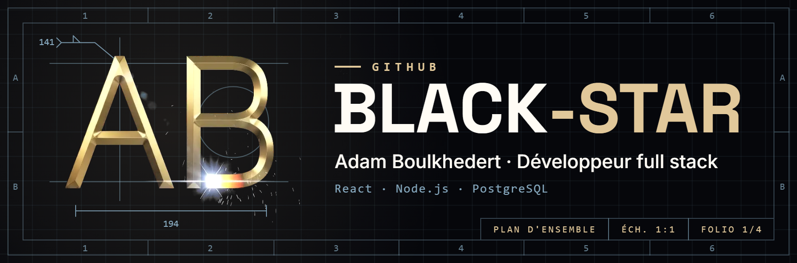
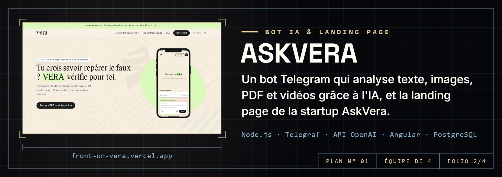
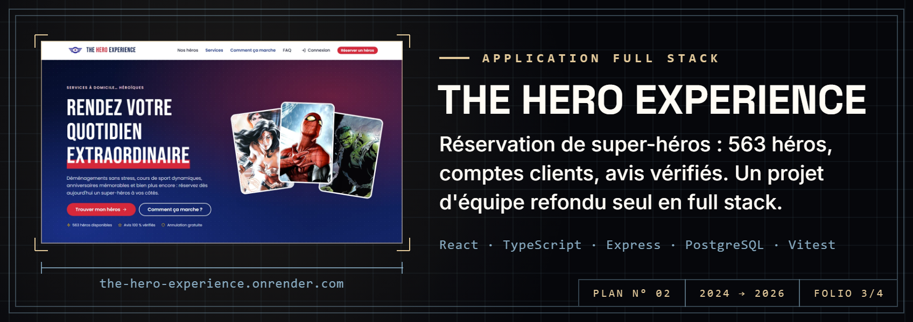
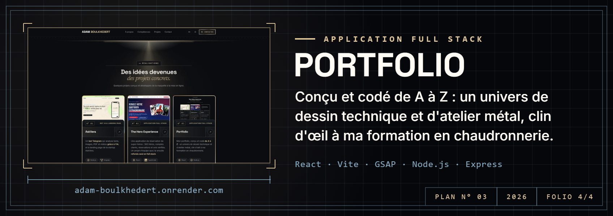

  <a href="https://adam-boulkhedert.onrender.com"><b>Portfolio</b></a>
  &nbsp;·&nbsp;
  <a href="https://www.linkedin.com/in/adam-boulkhedert"><b>LinkedIn</b></a>

 

  <a href="https://front-on-vera.vercel.app/">Site en ligne</a>
  &nbsp;·&nbsp;
  <a href="https://github.com/Black-Star-Pen/AskVera">Code</a>

  <a href="https://the-hero-experience.onrender.com">Site en ligne</a>
  &nbsp;·&nbsp;
  <a href="https://github.com/Black-Star-Pen/The-Hero-Experience">Code</a>

  <a href="https://adam-boulkhedert.onrender.com">Site en ligne</a>
  &nbsp;·&nbsp;
  <a href="https://github.com/Black-Star-Pen/PortFolio">Code</a>

