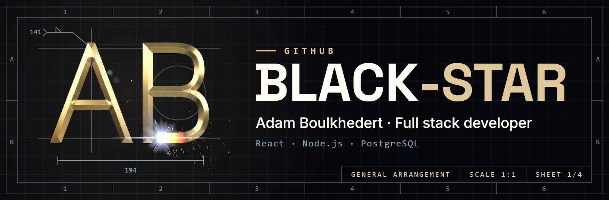
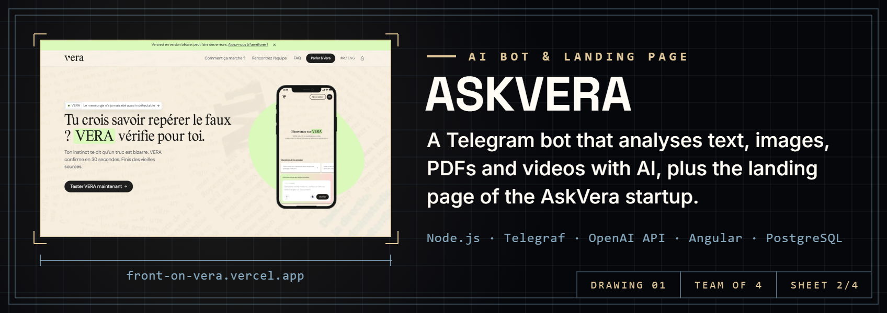
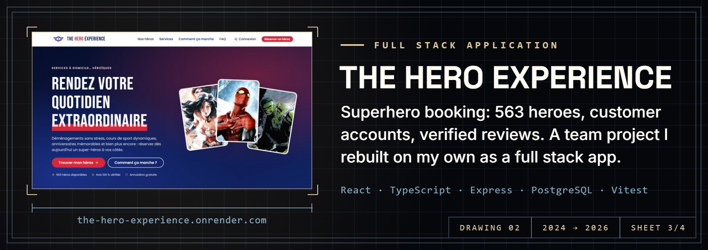
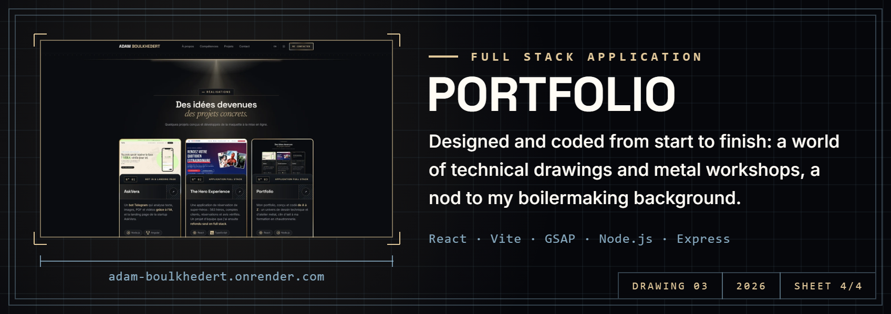

<b>Version française</b>

### Du métal au code, *le goût du travail bien fait.*

Mon parcours a débuté en **chaudronnerie industrielle**&nbsp;: déchiffrer un plan technique, respecter une cote au millimètre et ne rien laisser au hasard. Cet atelier m'a inculqué le sens de la structure, de la précision et de la **rigueur d'exécution**.

J'ai ensuite exercé pendant trois ans dans l'**hôtellerie 4 et 5 étoiles**. Ce milieu m'a appris la réactivité sous pression, la coordination d'équipe et le **sens aigu du service**, où chaque détail compte pour l'expérience finale.

Depuis 2024, je transpose ces exigences dans le **développement web**. Je conçois des applications de bout en bout —&nbsp;de la maquette au déploiement&nbsp;— avec le même principe directeur qu'à l'atelier&nbsp;: une pièce n'est achevée que lorsqu'elle est **parfaitement juste**.

  <a href="https://adam-boulkhedert.onrender.com"><b>Portfolio</b></a>
  &nbsp;·&nbsp;
  <a href="https://www.linkedin.com/in/adam-boulkhedert"><b>LinkedIn</b></a>

 

  <a href="https://front-on-vera.vercel.app/">Site en ligne</a>
  &nbsp;·&nbsp;
  <a href="https://github.com/Black-Star-Pen/AskVera">Code</a>

  <a href="https://the-hero-experience.onrender.com">Site en ligne</a>
  &nbsp;·&nbsp;
  <a href="https://github.com/Black-Star-Pen/The-Hero-Experience">Code</a>

  <a href="https://adam-boulkhedert.onrender.com">Site en ligne</a>
  &nbsp;·&nbsp;
  <a href="https://github.com/Black-Star-Pen/PortFolio">Code</a>

---

### From metal to code, *a taste for work done right.*

My career began in **industrial boilermaking**: reading a technical drawing, holding a dimension to the millimetre and leaving nothing to chance. That workshop gave me a sense of structure, precision and **rigour in execution**.

I then spent three years working in **4- and 5-star hotels**. That world taught me to react under pressure, to coordinate with a team and to keep a **sharp sense of service**, where every detail counts for the final experience.

Since 2024, I have carried those standards into **web development**. I build applications end to end — from mockup to deployment — with the same guiding principle as in the workshop: a part is only finished when it is **exactly right**.

  <a href="https://adam-boulkhedert.onrender.com"><b>Portfolio</b></a>
  &nbsp;·&nbsp;
  <a href="https://www.linkedin.com/in/adam-boulkhedert"><b>LinkedIn</b></a>

 

  <a href="https://front-on-vera.vercel.app/">Live site</a>
  &nbsp;·&nbsp;
  <a href="https://github.com/Black-Star-Pen/AskVera">Code</a>

  <a href="https://the-hero-experience.onrender.com">Live site</a>
  &nbsp;·&nbsp;
  <a href="https://github.com/Black-Star-Pen/The-Hero-Experience">Code</a>

  <a href="https://adam-boulkhedert.onrender.com">Live site</a>
  &nbsp;·&nbsp;
  <a href="https://github.com/Black-Star-Pen/PortFolio">Code</a>

